# Session Protocol — Domain Model & Contracts

Reference document for the formal WebSocket session protocol. Covers the domain
model, all message contracts, state machines, and key interaction sequences.
Use this to prevent drift between server (Rust) and client (JavaScript).

---

## 1. Domain Model

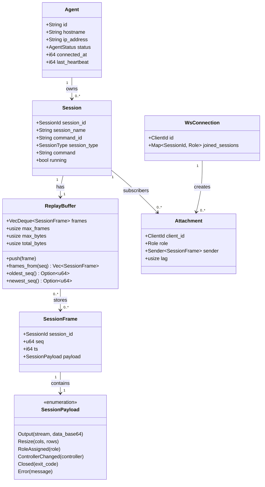

---

## 2. Role Model

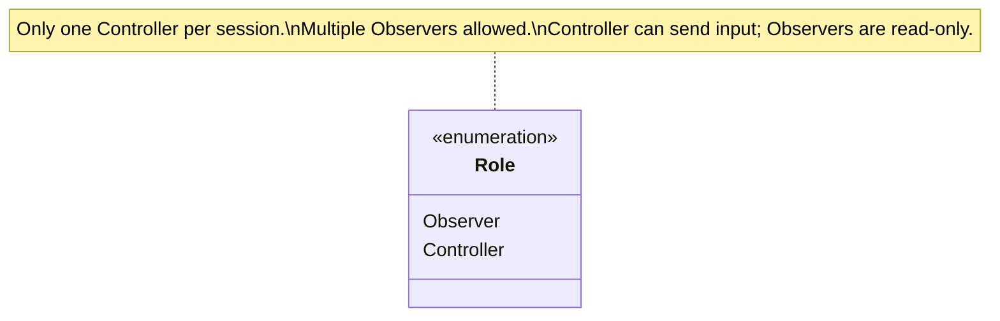

---

## 3. WebSocket Message Contracts

### 3.1 Client → Server Messages

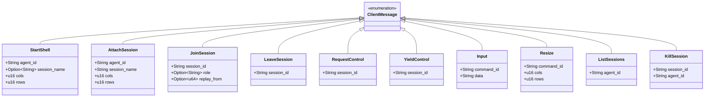

### 3.2 Server → Client Messages

```mermaid
classDiagram
    class ServerMessage {
        <<enumeration>>
    }

    class AgentList {
        +Vec~AgentInfoWs~ agents
    }

    class ShellStarted {
        +String agent_id
        +String command_id
        +String session_name
    }

    class Output {
        +String agent_id
        +String command_id
        +String data
    }

    class SessionList {
        +String agent_id
        +Vec~SessionInfoWs~ sessions
    }

    class SessionAttached {
        +String agent_id
        +String command_id
        +String session_name
        +String session_id
    }

    class SessionJoined {
        +String session_id
        +String role
        +u64 current_seq
    }

    class SessionLeft {
        +String session_id
    }

    class SessionFrame {
        +String session_id
        +u64 seq
        +i64 ts
        +SessionPayload payload
    }

    class ControlGranted {
        +String session_id
    }

    class ControlDenied {
        +String session_id
        +String reason
    }

    class Error {
        +String message
    }

    ServerMessage <|-- AgentList
    ServerMessage <|-- ShellStarted
    ServerMessage <|-- Output
    ServerMessage <|-- SessionList
    ServerMessage <|-- SessionAttached
    ServerMessage <|-- SessionJoined
    ServerMessage <|-- SessionLeft
    ServerMessage <|-- SessionFrame
    ServerMessage <|-- ControlGranted
    ServerMessage <|-- ControlDenied
    ServerMessage <|-- Error
```

### 3.3 SessionFrame Payload Wire Format

`SessionFrame` is tagged with `kind` (snake_case). All payload fields are
flattened into the top-level JSON object.

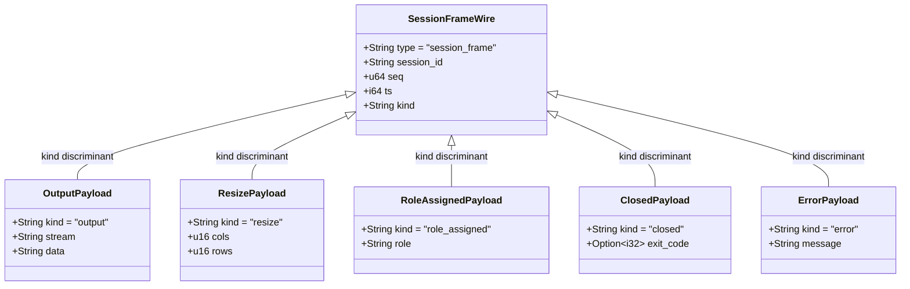

**Important**: `data` in `OutputPayload` is **base64-encoded raw PTY bytes**.
Clients must `atob(data)` and write as `Uint8Array` to xterm, not as a string.

`stream` values: `"stdout"` | `"stderr"` | `"log"`

---

## 4. Session State Machine

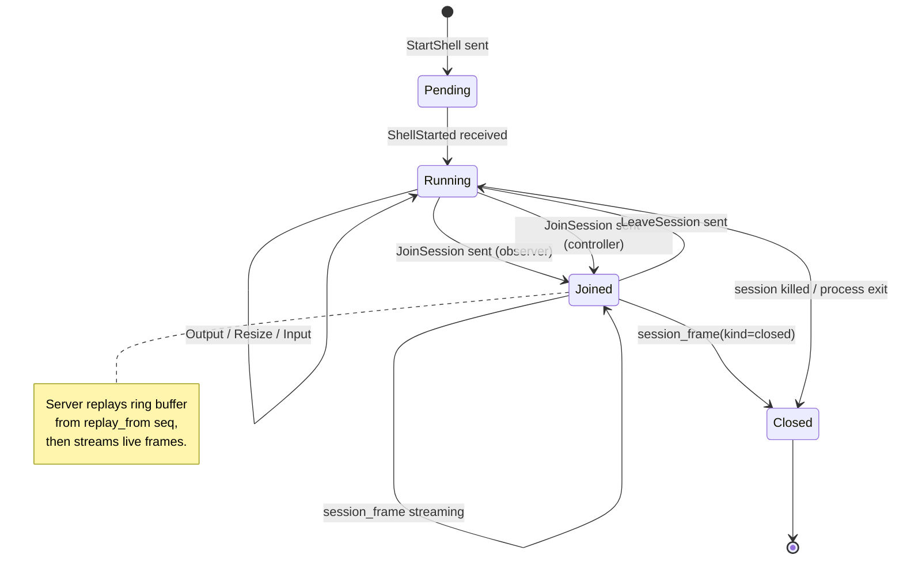

---

## 5. Interaction Sequences

### 5.1 New Shell Session (first connect)

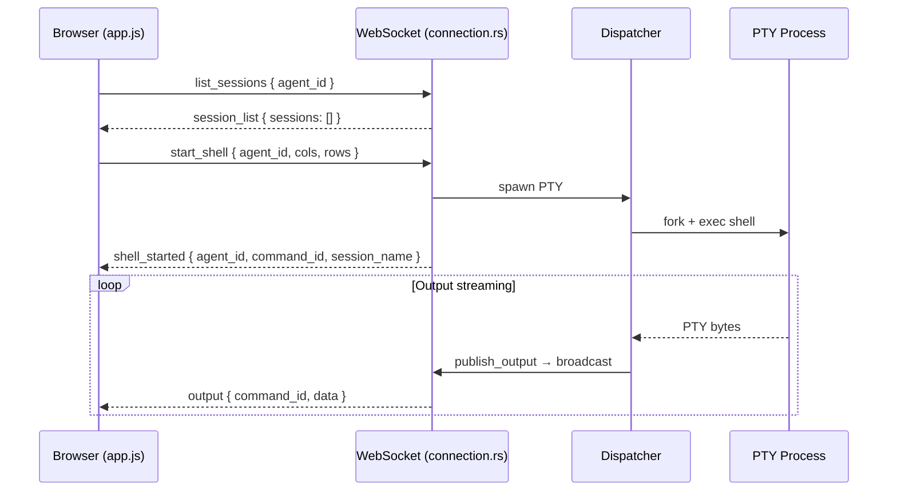

### 5.2 Reconnect with Replay (JoinSession)

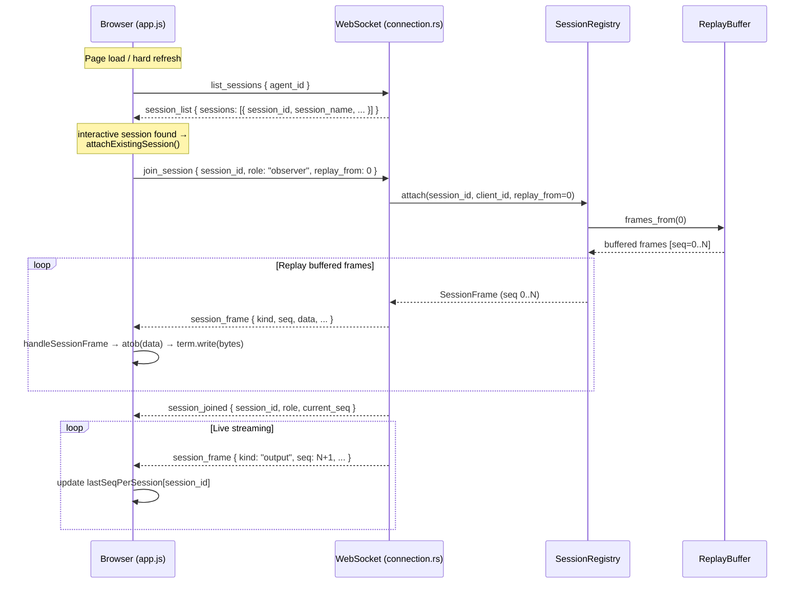

### 5.3 Incremental Reconnect (after disconnect)

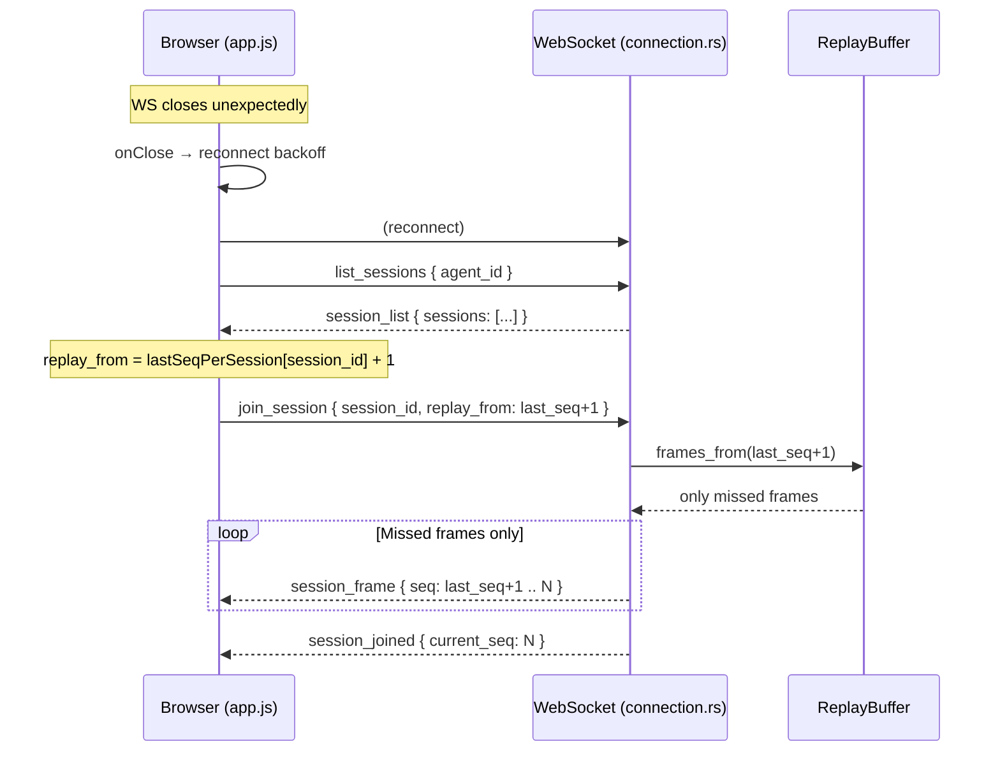

### 5.4 Controller Role Escalation

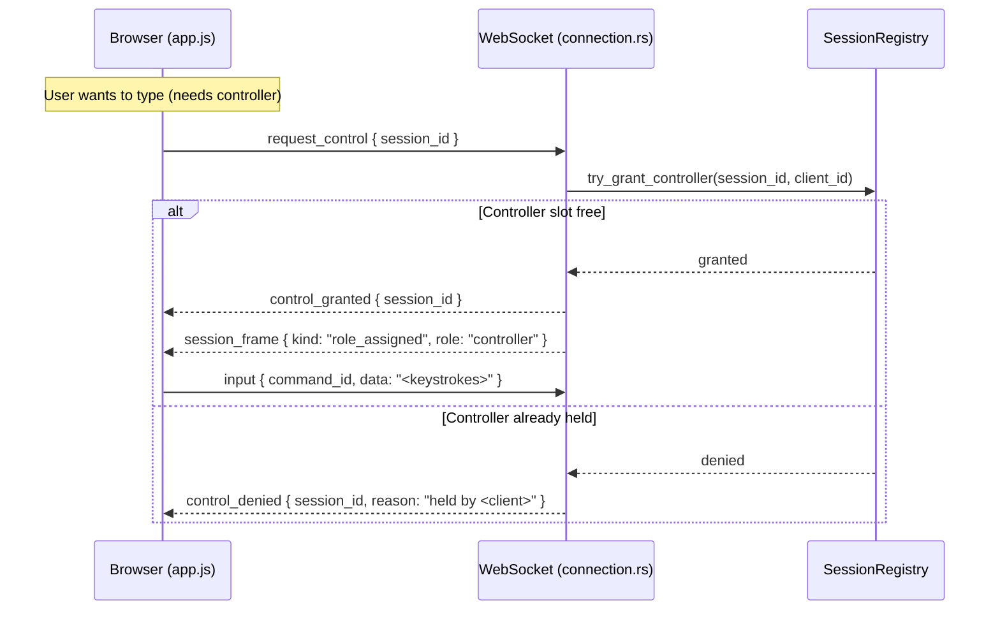

### 5.5 Suicide Snail Eviction (planned — Issue #149)

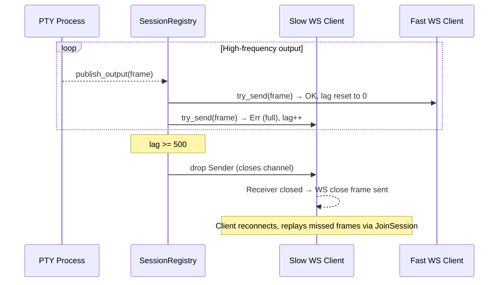

---

## 6. SessionId vs CommandId

These are frequently confused. This table is authoritative:

| Field | Type | Scope | Used for |
|---|---|---|---|
| `session_id` | `String` (UUID) | Stable across reconnects | `join_session`, `leave_session`, `request_control`, `session_frame` routing |
| `command_id` | `String` (UUID) | PTY process lifetime | `output` message routing, `input`, `resize`, legacy `attach_session` |

- `session_id` is created when a session is registered in `SessionRegistry`.
- `command_id` is created when the PTY process is spawned by the Dispatcher.
- One session has exactly one `command_id` for its lifetime.
- Clients using the formal protocol (JoinSession) use only `session_id`.
- Clients using the legacy protocol (attach_session) use `command_id` from `session_attached`.

---

## 7. Data Encoding

| Field | Encoding | Reason |
|---|---|---|
| `output.data` in `session_frame` | Base64 (standard) | PTY output is binary — ESC sequences, null bytes |
| `output.data` in legacy `output` message | UTF-8 string | Legacy path, may corrupt binary sequences |
| `ts` | Unix millis (i64) | Monotonic wall time for replay ordering |
| `seq` | u64, monotonically increasing per session | Replay cursor — safe to persist in localStorage |

**Client decode pattern** (always use this for `session_frame` output):
```js
const raw = atob(msg.data);
const bytes = new Uint8Array(raw.length);
for (let i = 0; i < raw.length; i++) bytes[i] = raw.charCodeAt(i);
term.write(bytes);
```

---

## 8. Client-Side State Map

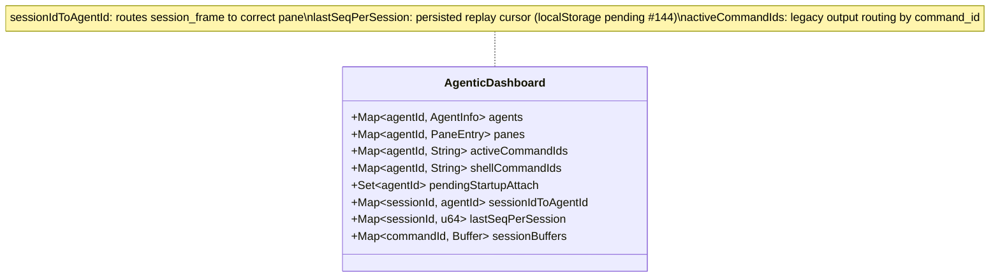

---

## 9. Open Implementation Gaps

| Issue | Title | Status |
|---|---|---|
| #143 | Use JoinSession for history-preserving reconnect | **Closed** (fa6ee4a) |
| #144 | Persist last_seq in localStorage | Open |
| #145 | Periodic keyframe injection | Open |
| #146 | broadcast() holds Mutex during fan-out | Open |
| #147 | ReplayBuffer stores base64 (25% overhead) | Open |
| #148 | Ring buffer not byte-capped | Open |
| #149 | No suicide snail for slow WS clients | Open |

---

## 10. File Map

| Concern | File |
|---|---|
| WS message types (Rust) | `management/src/ws/connection.rs` — `ClientMessage`, `ServerMessage` |
| Session domain (Rust) | `management/src/session/mod.rs` — `Session`, `SessionFrame`, `SessionPayload` |
| Ring buffer (Rust) | `management/src/session/replay.rs` — `ReplayBuffer` |
| Session registry (Rust) | `management/src/session/registry.rs` — `SessionRegistry`, `Attachment` |
| Client protocol (JS) | `management/ui/app.js` — `handleMessage`, `handleSessionFrame`, `attachExistingSession` |
