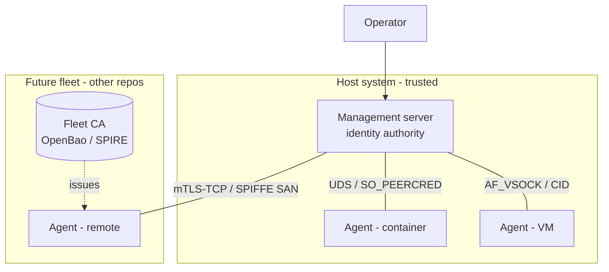
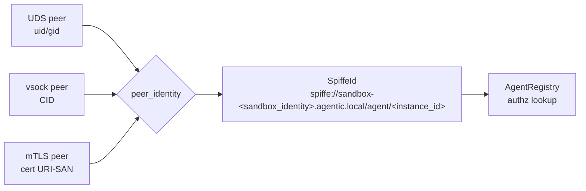
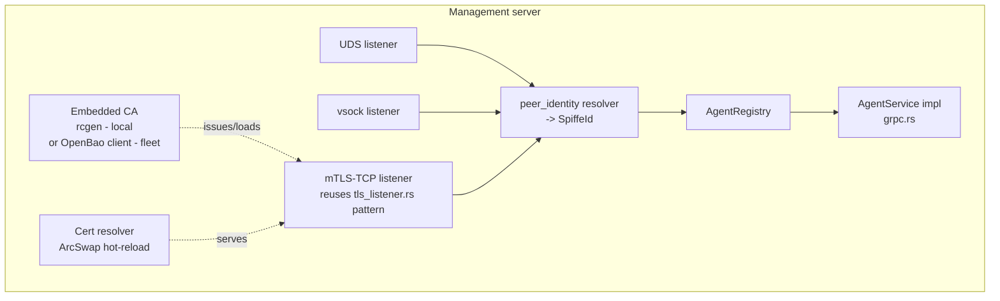

# Software Architecture Document — Agent Transport Security

**Document Version**: 0.2 (Reviewed)
**Date**: 2026-05-31
**Owner**: agentic-sandbox / roctinam
**Status**: Reviewed — ADR-023..027 accepted by Phase 0 gate
**Traces to**: @.aiwg/requirements/agent-transport-security-requirements.md, @.aiwg/security/agent-transport-threat-model.md
**Decisions**: ADR-023..027 (this suite)
**References**: @.aiwg/security/agent-transport-security-references.md

---

## 1. Reasoning

1. **Problem**: secure the internal management↔agent channel `[INT-1..4]`
   without imposing cert maintenance on users (G-3).
2. **Constraints**: local-first, single binary, no external CA locally (G-7);
   two runtimes with different isolation primitives (container vs VM).
3. **Alternatives**: encrypt-the-TCP (mTLS everywhere) / remove-the-network
   (UDS+vsock) / transparent overlay (WireGuard). Evaluated in ADR-023.
4. **Decision**: a **transport-per-runtime** design unified by a single
   **identity normalization layer** producing a SPIFFE-style id.
5. **Risk**: vsock+tonic maturity (R-1) is the main implementation unknown;
   mTLS-TCP is the universal fallback.

## 2. Context (C4 L1)



External orchestrator↔sandbox auth (`[ADR-015]`/`[ADR-018]`) and the
`pty-ws/v1` surface (`[ADR-020]`) are **outside** this diagram by design.

## 3. Transport-per-runtime model (the core design)

The channel requirement is abstract: *an authenticated, confidential channel
with a bound identity* (NFR-SEC-1/2/3). Each runtime satisfies it with the
strongest primitive it natively offers; certificates are used **only where no
kernel/hypervisor mediation exists**. Note (F-2, verified): for VMs the host
side is usually an **AF_UNIX socket** that the VMM bridges to the guest's
AF_VSOCK, so the management server reuses tonic's first-class UDS support
`[TOOL-TONIC-UDS][TOOL-VHOST-VSOCK]`; only native host-side AF_VSOCK needs the
`tokio-vsock` shim (ADR-023, R-1).

| Runtime | Transport | Confidentiality | Identity (native) | Certs? |
|---------|-----------|-----------------|-------------------|--------|
| Container (same host) | gRPC over **UDS** | kernel-local (never on a NIC) | `SO_PEERCRED` uid/gid/pid `[STD-PEERCRED]` | **none** |
| VM (QEMU/Firecracker, same host) | gRPC over **vsock** — host-side AF_UNIX bridge (Firecracker / `vhost-device-vsock --uds-path`) or native AF_VSOCK | host↔guest, unsniffable by other guests | host-assigned **CID** `[STD-VSOCK-FC][STD-VSOCK-QEMU]` | **none** |
| Remote / fleet | gRPC over **mTLS-TCP** | TLS 1.3 AEAD `[STD-TLS13]` | client-cert **URI-SAN** `[STD-X509]` | yes (backend-issued) |

**Fallback ladder** (FR-9, R-7): per runtime, pick the most-isolated available
transport; if vsock is unavailable on a VM host, fall back to mTLS-TCP and
record the choice on the agent's registry entry.

### 3.1 Why this satisfies "zero cert maintenance"
For the local-first build (container + VM on one host) the selected transports
carry **no certificates at all** — there is nothing to issue, install, renew,
or revoke (S-2, S-5, NFR-OPS-1). Certs appear only in the fleet build, where
the backend owns their entire lifecycle (ADR-025/027).

## 4. Identity normalization layer (ADR-024)

All three transports feed a single resolver that yields one identity type:



- **UDS**: map socket-peer uid (and the provisioning record) → `instance_id`.
- **vsock**: map CID (assigned by management at VM create) → `instance_id`.
- **mTLS**: read URI-SAN, which **is** the SPIFFE id.
- **Trust domain**: local installs use a per-install domain derived from the
  persisted `SandboxIdentity`: `sandbox-<sandbox_identity.id>.agentic.local`.
  Fleet issuers may use their governed fleet domain while preserving the same
  `/agent/<instance_id>` path shape.

`AgentRegistry` (authz) is keyed solely on the normalized `SpiffeId` (FR-4),
so command dispatch, session reconciliation, and audit are transport-agnostic.
This replaces the `x-agent-id`/`x-agent-secret` check in
`management/src/grpc.rs:78-94` `[INT-3]` with `peer_identity(&conn)`.

## 5. Component view (server side)



Key reuse: `management/src/http/tls_listener.rs` `[INT-5]` already implements
CA-verify + x509 SAN/CN extraction for the operator API; L3 ports that to the
tonic `Server`. `rcgen` + rustls are already deps `[INT-7]`.

## 6. Connection sequence (container, UDS — happy path)

```mermaid
sequenceDiagram
  participant Prov as provision (mgmt)
  participant Ag as Agent (container)
  participant Sock as UDS (0600)
  participant Mgmt as Management
  Prov->>Ag: start with AGENT_TRANSPORT=uds, socket path (no secret)
  Ag->>Sock: dial
  Sock-->>Mgmt: accept; SO_PEERCRED = uid/gid/pid
  Mgmt->>Mgmt: peer_identity() -> SpiffeId(instance_id)
  Mgmt->>Mgmt: AgentRegistry.lookup(SpiffeId)
  alt known
    Mgmt-->>Ag: stream established (commands + PTY)
  else unknown
    Mgmt-->>Ag: REJECT (no TOFU)  %% FR-7
  end
```

VM/vsock is identical with CID in place of peercred. mTLS adds a TLS handshake
+ SAN extraction before `peer_identity()`.

## 7. Configuration model (first-class)

```
[transport]
mode = "auto"            # auto | uds | vsock | mtls   (FR-9)
# auto: container->uds, VM->vsock(if available)->mtls, remote->mtls

[transport.uds]
path = "/run/agentic-sandbox/agent.sock"   # dir 0700, sock 0600 (R-4)

[transport.vsock]
port = 5005                                 # host CID assigned at VM create

[transport.mtls]                            # fleet / TCP only
ca = "..."        # CA bundle to verify peers
cert = "..."      # server leaf (hot-reloaded)
key = "..."
trust_domain = "sandbox-<sandbox_identity>.agentic.local"
leaf_ttl = "1h"                             # fleet default; renew at ~50% + jitter

[transport.compat]
accept_legacy_secret = true   # dual-mode window only; removed at cutover (FR-8)
```

Defaults: `mode=auto`, `accept_legacy_secret=false` post-cutover. An
`--insecure`/conformance escape hatch mirrors the existing
`AIWG_CONFORMANCE_MODE` pattern in `main.rs`.

## 8. Changes to existing code (delta map)

| File | Change |
|------|--------|
| `agent-rs/src/main.rs:1430` `[INT-1]` | Replace fixed `http://` dial with transport-selected dial (UDS/vsock/mTLS). |
| `agent-rs/src/main.rs:1772-1782` `[INT-2]` | Drop `x-agent-secret` metadata (kept only behind compat flag during window). |
| `agent-rs/Cargo.toml:18` `[INT-8]` | Add `tls` feature to tonic; add vsock dep. |
| `management/src/grpc.rs:78-94` `[INT-3]` | Replace `authenticate()` with `peer_identity()` resolver. |
| `management/src/auth.rs` `[INT-4]` | Remove TOFU auto-register; retire `SecretStore` after cutover. |
| `management/src/http/tls_listener.rs` `[INT-5]` | Extract shared CA-verify/SAN-extract; reuse for gRPC L3. |
| `deploy/cloud-init/*`, `images/qemu/provision-vm.sh` `[INT-6]` | Stop templating `AGENT_SECRET`; for vsock assign CID; for fleet inject CA + one-time token. |

## 9. Cross-cutting concerns

- **PTY semantics unchanged**: PTY is bytes on the stream `[INT-9]`; transport
  swap is invisible to `PtyControl`/`OutputChunk` handling.
- **Reconnect**: existing backoff loop (`main.rs:1604`) re-establishes the
  chosen transport; on fleet cert renewal the agent re-dials (cheap).
- **Audit**: connection events carry the normalized `SpiffeId`.
- **Authz unchanged**: `AgentRegistry` mapping reused (NG-5).

## 10. Phase 0 review decisions

- OQ-1 / R-1: `tonic 0.12` + `tokio-vsock 0.7.2` `Connected` shim verified in
  `@.aiwg/spikes/spike-005-native-vsock-tonic.md`; real microVM
  guest-to-host coverage remains a Phase 1 integration gate.
- OQ-2 / R-7: host-side AF_UNIX bridge remains the default VM path, native
  AF_VSOCK is allowed where available, and mTLS-TCP remains the fallback.
- OQ-3 / ADR-024: local trust domain is per-install, derived from
  `SandboxIdentity`; fleet can use its governed domain with the same SPIFFE
  path shape.
- ADR-027: fleet default leaf TTL is 1h, renewed at ~50% lifetime plus jitter.
- ADR-026: Phase 3 legacy-secret/TOFU removal waits until the default agent
  image fleet ships the new client and the Phase 2 released-image cohort passes
  integration and capture gates.

## References

- @.aiwg/architecture/adr/ADR-023-transport-per-runtime-security.md
- @.aiwg/architecture/adr/ADR-024-unified-spiffe-identity.md
- @.aiwg/architecture/adr/ADR-025-embedded-ca-and-issuance.md
- @.aiwg/architecture/adr/ADR-026-enrollment-and-secret-retirement.md
- @.aiwg/architecture/adr/ADR-027-cert-lifecycle-and-hot-reload.md
- @.aiwg/testing/agent-transport-security-test-strategy.md
- @.aiwg/security/agent-transport-security-references.md
