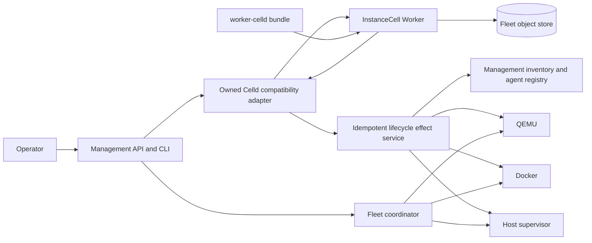
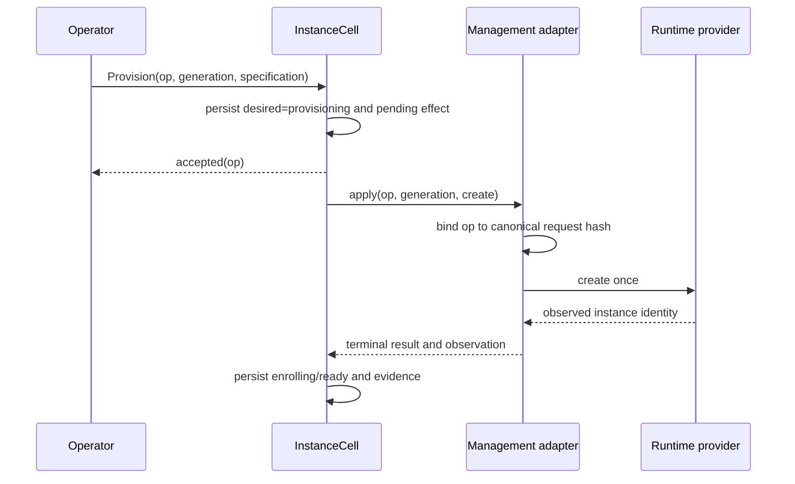
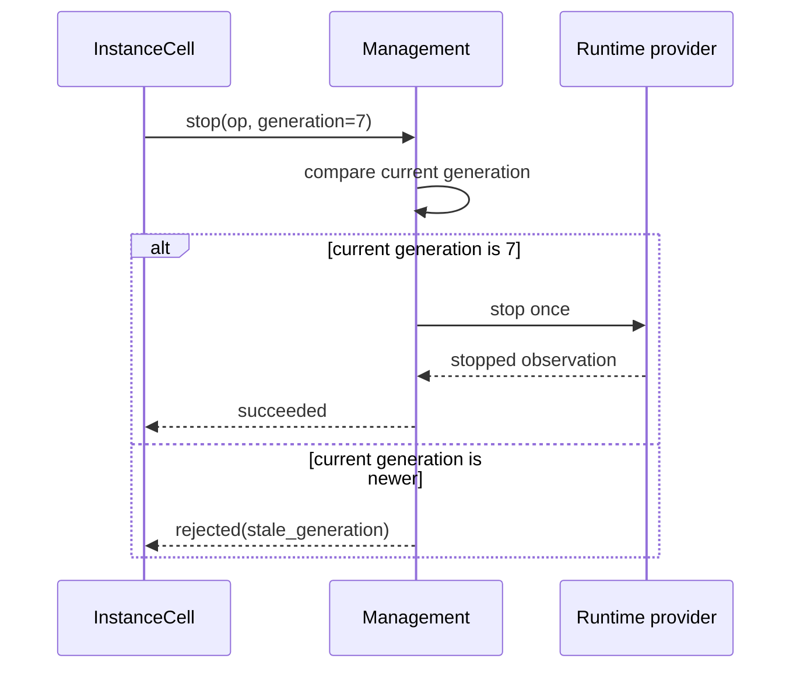
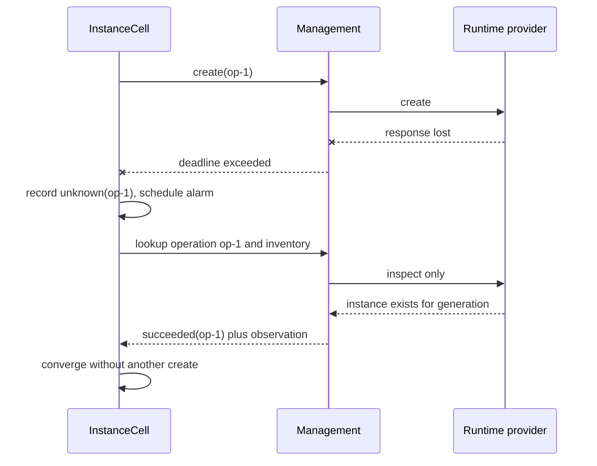
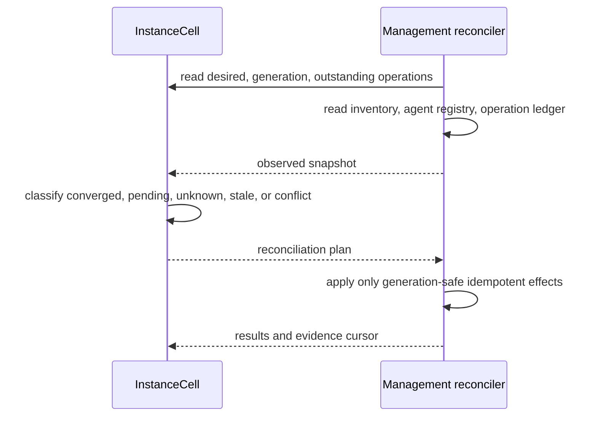

# Celld integration architecture baseline

Status: POC baseline
Program: #747; architecture gate: #748
Upstream baseline: Celld `v0.2.1` (`ae8fac053d79f971bfcb996054bb43eb2f9b05da`)

## Decision

Agentic Sandbox integrates Celld in three distinct roles:

1. `InstanceCell` is an optional durable coordinator for one logical runtime
   instance. It owns desired state, accepted commands, retry scheduling, and
   transition evidence.
2. `worker-celld` is a constrained JavaScript/WebAssembly runtime family. It
   is not an operating-system, VM, container, PTY, or workspace runtime.
3. A managed Celld fleet is a workload deployed on an existing QEMU, Docker,
   or host substrate. Management owns its declarative fleet specification and
   lifecycle.

Celld is disabled by default. When disabled, no Celld runtime is available, no
Celld endpoint is contacted, and existing instance storage and lifecycle paths
remain unchanged.

## Authority model

| Field or decision | Authority | Repair rule |
|---|---|---|
| Logical instance identifier | Management | Immutable after allocation; reject a cell whose binding differs. |
| Incarnation generation | Management | Monotonic per logical instance; reject commands from older generations. |
| Desired lifecycle state | `InstanceCell` | Reconcile management toward the cell after generation validation. |
| Accepted command and retry schedule | `InstanceCell` | Replay by operation identity until management reports a terminal result. |
| Observed runtime state | Management inventory/provider | Refresh the cell observation; never overwrite observed truth from desired state. |
| Agent enrollment/readiness | Management registry | Refresh the cell observation and derive divergence diagnostics. |
| Runtime effect result | Management operation store/provider | Query by operation identity after timeout before considering another effect. |
| Cell ownership epoch and durable bytes | Celld/object store | Celld fencing decides the current writer; Sandbox never fabricates an epoch. |
| Fleet desired version and topology | Management fleet manifest | Refuse incompatible transitions; converge nodes to the pinned manifest. |
| Deployed application version | Celld deployment pointer | Compare with the pinned manifest and report drift before rollout/rollback. |
| Audit export | Both, by provenance | Preserve cell transition evidence and management effect evidence as separate sources. |

The object store is a Celld durability and fencing authority only. Bucket
access does not imply access to Agentic Sandbox artifacts, workload
credentials, or management APIs.

## Components

The compatibility adapter is owned by Agentic Sandbox and is the only code
that consumes Celld's alpha operator/application surfaces. Other management
modules depend on the versioned contracts in `docs/contracts/celld/`.

## `InstanceCell/v1` contract

The normative JSON contract is
[`instance-cell-v1.schema.json`](../contracts/celld/instance-cell-v1.schema.json).
A cell represents one logical instance. Mission and task actors are deferred
until the instance POC passes qualification.

### States

`requested -> provisioning -> enrolling -> ready -> stopping -> stopped`

`failed`, `unknown`, and `destroyed` are explicit. `destroyed` is a retained
tombstone, not immediate deletion. `unknown` means that an effect outcome must
be discovered; it never authorizes a duplicate destructive effect.

### Command rules

- Every command carries an opaque `operation_id`, logical `instance_id`, and
  positive `generation`.
- The operation ID is bound to the canonical request hash. Reuse with another
  payload is rejected.
- Repeating the same operation ID returns the recorded acceptance or terminal
  outcome and creates no new effect.
- A command whose generation is older than the management observation is
  terminally rejected as `stale_generation`.
- A future generation is rejected until management has explicitly created and
  observed that incarnation.
- `succeeded`, `failed`, and `rejected` are terminal operation outcomes.
  `pending`, `dispatched`, and `unknown` are reconcilable.
- Retrying a terminal failure requires a new operation ID. Transport retries
  reuse the original operation ID.

## Consistency protocol

There is deliberately no distributed transaction between a cell mutation and
a management lifecycle call.

1. The cell transaction validates generation and state, records the command,
   advances desired state, and records a pending effect before acknowledging.
2. The adapter submits the effect to management with the operation ID and
   canonical request hash.
3. Management's idempotency ledger accepts one payload per operation ID and
   returns the existing operation for duplicates.
4. The runtime provider executes at most one externally visible effect for
   that operation record.
5. The cell records the terminal result. If the response is lost, it records
   `unknown` and queries the operation and inventory; it does not issue a new
   effect identity.

This provides at-most-one externally visible effect per operation identity,
not exactly-once transport delivery.

## Lifecycle sequences

### Provision

### Stop and stale-generation rejection

### Timeout, retry, and recovery

### Reconciliation after either side restarts

## Runtime capability matrix

| Capability | QEMU | Docker | Host | `worker-celld` |
|---|---:|---:|---:|---:|
| `task.exec` | yes | yes | yes | no |
| `session.pty` | yes | yes | yes | no |
| `workspace.bind` | yes | yes | yes | no |
| `process.spawn` | yes | yes | yes | no |
| `worker.fetch` | no | no | no | yes |
| `worker.rpc` | no | no | no | experimental |
| `durable.storage` | no | no | no | yes |
| `durable.alarm` | no | no | no | yes |
| `websocket.inbound` | via agent | via agent | via agent | yes |
| `network.outbound.fetch` | policy | policy | policy | policy-constrained |
| `wasm.module` | via OS | via OS | via OS | yes |
| Isolation label | hardware virtualized | shared kernel | full host access | shared process/isolate; not hostile multi-tenant |

Discovery must publish exclusions as well as positive capabilities. Absence of
`task.exec`, `session.pty`, and `workspace.bind` is normative for
`worker-celld`.

## Failure and authority matrix

| Failure | Authoritative evidence | Expected behavior | Operator repair |
|---|---|---|---|
| Management restart | Cell intent plus management durable operation/inventory | Re-open ledgers and reconcile; no new operation identity. | `sandboxctl celld reconcile INSTANCE` |
| Cell owner loss | Object-store lease/epoch and replicated cell bytes | New owner restores acknowledged intent and resumes alarms. | Diagnose fleet; replace node if capacity is low. |
| Object-store outage/throttle | Storage errors and Celld fencing state | Stop acquiring ownership; preserve management runtime truth; mark coordination degraded. | Restore qualified storage; reconcile after fencing recovers. |
| Network partition | Signed request freshness and both observations | Refuse stale/destructive effects; expose unknown outcome. | Repair network, then reconcile by original operation IDs. |
| Runtime provider loss | Management provider inventory | Desired state remains durable; retry only retryable operations. | Repair provider or explicitly abandon desired state. |
| Agent never enrolls | Management agent registry | Provisioning times out into a visible retry/failed policy. | Inspect bootstrap readiness; retry with a new operation ID if terminal. |
| Stale cell generation | Management generation | Reject stop/destroy before provider invocation. | Refresh the cell binding; never lower management generation. |
| Deployment-version drift | Pinned fleet manifest and Celld deployment pointer | Block rollout and report compatibility result. | Pin a compatible pair or execute explicit rollback. |

## Compatibility and release pinning

- POC support is pinned to Celld `v0.2.1` and the exact upstream commit shown
  above. Binary/OCI activation requires a digest and a successful upstream
  provenance verification. Tags such as `latest` are invalid.
- Management consumes only the public Worker request surface and the subset of
  operator behavior wrapped by the owned compatibility adapter.
- Each adapter response includes `adapter_version`, `celld_version`, and
  `protocol_version`. Unknown or incompatible protocol versions fail closed.
- Rolling transitions require an explicit compatible version pair in the fleet
  manifest. Unknown pairs are non-rolling and require a full, availability-
  impacting plan or a refusal.
- Security fixes apply only to the latest upstream alpha; an older pin is
  automatically outside supported production posture.
- Schema changes are additive within `v1`. A semantic break creates `v2` and a
  migration/rollback plan.

## Backward compatibility

- `AGENTIC_CELLD_ENABLED` defaults to false.
- Existing `qemu`, `docker`, and `host` requests, persisted instances, runtime
  descriptors, and lifecycle semantics are unchanged when the flag is false.
- Celld state is namespaced separately and is never used as a fallback source
  of observed runtime truth.
- Disabling Celld stops new cell commands but leaves existing runtime instances
  manageable through the normal APIs. Re-enabling resumes reconciliation.

## Security and data-classification inputs

| Data | Classification | Notes |
|---|---|---|
| Operation IDs, generations, state names, coarse metrics | Internal | Safe for correlated logs after tenant/fleet scoping. |
| Task inputs/outputs, Worker storage, cell SQLite bytes | Confidential by default | Bucket encryption, access control, retention, and redacted telemetry required. |
| Fleet bucket credentials and peer authentication material | Restricted | One fleet/trust domain, leased delivery, never logs/artifacts/images. |
| Worker bundles and Wasm modules | Internal or Confidential | Digest, signer, provenance, and deployment version required. |
| Public Worker responses/assets | Public only by application policy | Celld does not supply application authentication or TLS policy. |

Hostile multi-tenancy, public internal listeners, shared bucket credentials
across trust domains, unsigned bundles, and unqualified object stores are
explicit support exclusions.

## POC plan and go/no-go measures

The POC starts with Docker and QEMU, evaluates host explicitly, and keeps all
three Celld roles experimental.

| Measure | Go threshold |
|---|---|
| Duplicate lifecycle delivery | 10,000 repeats per action; zero duplicate provider effects. |
| Management restart during provision | 100 trials; 100% converge; p95 under 30 seconds after restart. |
| Celld owner loss after acknowledgment | 100 trials; zero lost intents; p95 takeover/reconcile under 30 seconds. |
| Stale generation destructive command | 100% rejected before provider invocation. |
| Celld disabled regression | Existing unit/E2E suites unchanged; stored instances remain operable. |
| Worker capability honesty | 100% negative tests reject process, PTY, workspace, raw TCP/SSH, and arbitrary filesystem claims. |
| Fleet listener separation | Public ingress cannot reach any internal/operator route. |
| Object-store qualification | Conditional create/overwrite and read-after-write tests pass before provisioning. |
| Roll/rollback | Availability stays within the manifest budget; incompatible pairs are refused. |

Go/no-go is decided separately for durable orchestration, constrained Worker
execution, and managed fleets. Passing one lane never promotes another.

## Bounded review conditions

The #748 baseline is approved for implementation subject to these recorded
conditions:

- Security: private/internal listener only, one trust domain per fleet,
  restricted credential delivery, provenance verification, and no hostile
  multi-tenancy until #752 passes.
- Operations: experimental only until upgrade compatibility, reserve capacity,
  backup/recovery, alerts, and runbooks pass #753.
- Test: no production claim until every invariant and the quantitative POC
  thresholds pass #754 on pinned versions and documented hardware/storage.

These are gating conditions, not deferred suggestions.
