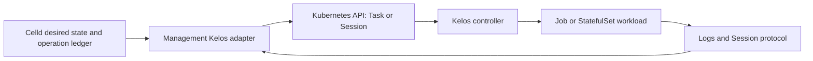

# Kelos runtime-provider research spike (#818)

**Decision:** Defer production runtime-provider adoption. Kelos is a plausible
optional Kubernetes execution integration, but is not currently a drop-in
implementation of Sandbox's persistent runtime contract.

**Evaluated:** Kelos **v0.54.0**, commit
`13e06522ae62fd8a4838174a09cb5827a65455d1`, released 2026-08-30.
Research performed 2026-09-05 UTC. Sandbox baseline:
`fce0386236db0806c5ab48c56cd30f1244e6ea45`.

**Evidence level:** Source and documentation review. No Kelos workload or
Kubernetes benchmark was executed. The issue expressly permits a concrete
experiment plan when suitable isolated infrastructure is unavailable; that
plan is [provided separately](kelos-runtime-experiment-818.md).

## Recommendation and decision gates

Kelos already supplies useful building blocks: one-shot Tasks, persistent
Sessions, reusable WorkerPools, repository preparation, logs, and event-driven
work creation. Reimplementing these inside a new VM backend would duplicate
orchestration. Prefer an external execution adapter if a Kubernetes use case
justifies the additional control plane. Keep infrastructure provider identity
separate from the coding-agent launcher selected by `ProviderExecutor`.

Production adoption is deferred until these four gates have evidence:

1. A disposable-cluster experiment demonstrates task cancellation, Session
   persistence, cleanup, and recovery, including a failed Job's repeat effects.
2. A design preserves Sandbox operation IDs, payload hashes, generations,
   tombstones, and reconciliation across Kubernetes object replacement.
3. The selected Kubernetes runtime and admission policies meet the intended
   isolation tier; ordinary Pods cannot be advertised as KVM VM isolation.
4. Gitea checkout/authentication and result reporting work end to end, and the
   credential path has an explicit migration design from Sandbox file leases.

**Rough effort (engineering estimate, not measured):** 2–3 engineer-days for
cluster qualification; 5–8 for an opt-in Task adapter with reconciliation and
logs; another 5–10 for persistent Session control, storage, and UI integration;
3–5 for hardening, recovery tests, and operational documentation. Allow roughly
3–5 engineer-weeks total, excluding cluster procurement and upstream changes.
A Task-only prototype must identify its unsupported runtime capabilities.

No implementation issues are opened by this defer recommendation. If the
qualification gates justify adoption, split follow-up work into (1) cluster
qualification fixture, (2) idempotent Task adapter, (3) Session/storage/control
integration, and (4) isolation/Gitea/upgrade qualification. Each depends on the
preceding contract decisions; do not make this research issue a production
implementation epic.

## Upstream maturity and installation

The latest-release API returned v0.54.0 during research. The release points to
the commit above; v0.44.0 points to `dd86a426525cb214b6545466564617ce53d12c4c`.
The older release lacked the Session API now present in v0.54.0, illustrating
why evaluation against floating `main` or an old search result is insufficient.
The [release][release], pinned [API types][task-api], and [chart guide][chart]
provide the evaluation baseline. Frequent recent releases indicate active
maintenance, not an established compatibility guarantee.

The repository carries Apache-2.0 license text in [LICENSE][license]. Record
license/notice obligations and the separate licenses of packaged coding tools
and images during implementation; this is an inventory observation, not a
legal compatibility determination.

The [README][readme] requires Kubernetes 1.28+ and cert-manager. The chart
installs a controller, cluster-scoped RBAC, conversion webhook/certificate,
and CRDs; console, integrations, and monitoring add optional components.
Fresh Helm installs require `crds.install=true`. Existing CRD upgrades require
controller/webhook readiness before conversion-enabled CRDs are updated.
CRDs are retained on uninstall by default; custom resources with finalizers
must be removed while their controller is still available. See [chart][chart].

The API remains `v1alpha2` with legacy `v1alpha1` conversion for older resources.
`Task.spec.worker` supersedes legacy top-level fields. Session specifications
have immutable fields, so an incompatible change can require replacement and
storage planning. Pin the chart, controller, agent, and helper images together;
[chart defaults][values] include a floating image tag and enable telemetry.
Explicitly configure telemetry and resource requests/limits. Do not assume the
chart's checked-in development version (`0.1.0`) is the release artifact version.

## Capability matrix

Baseline: [Sandbox runtime parity](../runtime-parity.md). **N** = native Kelos
API/source support; **A** = Sandbox adapter or cluster policy required;
**U** = unsupported in the reviewed Kelos contract; **?** = unverified live.
All N entries are source findings, not successful runtime tests.

| Sandbox capability | Kelos finding | Classification and consequence |
| --- | --- | --- |
| CPU/memory limits | Worker pod overrides carry resource requests/limits | N/?; configure limits for auxiliary containers too |
| PID limits | No first-class Worker PID limit | A/?; node/runtime policy required |
| Disk quota | PVC sizing and Kubernetes volume primitives | A/?; storage capacity is not a proven per-workload hard quota |
| Seccomp | Pod security context and agent container override | N/A/?; establish an admission policy for all containers |
| AppArmor/SELinux | Kubernetes security context can express policy | A/?; host policy availability and enforcement unqualified |
| Network modes | Pod networking, scheduling, services | A; Sandbox isolated/gateway/host modes have no direct mapping |
| Volume mounts | Additional volumes/mounts; Session PVC; WorkerPool PVC | N/A/?; map ownership and access modes |
| Loadout cloud-init | Images, Workspace setup, AgentConfig | U for cloud-init; A for translating a supported loadout subset |
| Agentshare global-ro | Read-only mounted volume can represent assets | A/?; no native agentshare protocol or mount-tag guarantee |
| Agentshare inbox/outbox | Separate writable mounts can carry files | A/?; reconcile permissions, transfer, and retention |
| VSock enrollment/control | No reviewed VSock/guest enrollment interface | U; use an explicit network adapter or custom enrolled agent |
| Environment variables | Worker environment overrides and Secret references | N/A; built-in credential environment differs from file leases |
| Logging/metrics | Pod log streaming, Task status/usage, metrics/PodMonitor | N/A/?; correlate, redact, retain, and translate into Sandbox events |
| Health/readiness | Task phases; Session Ready condition and pod identity | N/A/?; Ready is infrastructure readiness, not completed work |
| Lifecycle events | Kubernetes watch/status and controller events | N/A/?; watch resumption and event loss need reconciliation |
| Start/stop/destroy | Session suspend/resume/delete; Task create/delete | N/A/?; no general stop/resume of a one-shot Task process |
| Orphan cleanup | Ownership, Task finalizers, TTL, Session-owned PVCs | N/A/?; test controller outage and storage reclaim behavior |
| Agent deployment | Supported agent images and custom image contract | N/A; Sandbox CA/loadout deployment is separate |
| Snapshot/restore | Session history/workspace persistence | U for VM/process-memory snapshot/restore |
| Warm-pool handoff | WorkerPool maintains reusable StatefulSet workers | N/A/?; different lifecycle from credential-free paused VM handoff |
| Fork from warm base | No reviewed VM-memory fork interface | U; clone/copy storage is not live-memory fork |
| Snapshot secret hygiene | No equivalent clean-base attestation flow | U; persisted workspace and cluster snapshots need their own policy |
| GPU passthrough | Resource/scheduling fields can target GPU-capable nodes | A/?; device-plugin allocation does not prove whole-IOMMU-group VFIO |
| Multiple agents per host | Kubernetes scheduling and WorkerPool replicas | N/A/?; capacity and tenant isolation are cluster responsibilities |

Sources: [Task/WorkerSpec][task-api], [Session API][session-api],
[WorkerPool API][pool-api], [job builder][job-builder],
[Session controller][session-controller], [reference][reference].

## Persistence, execution, and recovery findings

A Workspace describes Git inputs; it is not itself a persistent filesystem.
A normal Task creates a Job with an ephemeral workspace unless storage is
explicitly supplied. A WorkerPool uses StatefulSet workers with a required PVC
template. A Session optionally uses a PVC, and otherwise uses `emptyDir`.
Session history lives in the workspace, not the Kubernetes API. With ephemeral
storage, Pod replacement can replay `initialPrompt`; persistent history avoids
that particular replay but does not prove exactly-once external tool effects.
Session suspend preserves configured persistent storage; deleting the Session
removes its owned workspace storage. Sources: [Workspace][workspace-api],
[Session][session-api], [WorkerPool][pool-api], [Session controller][session-controller].

A critical finding is `backoffLimit := int32(1)` and `RestartPolicyNever` in the
[job builder][job-builder]. The Job can create another Pod after failure.
An adapter that creates a Task only once therefore does **not** automatically
provide at-most-one execution of the prompt. Separate at-most-one provider
submission from retries inside the workload, and test partial side effects.
Task dependency/branch/budget waiting also needs an explicit queued state.
The [Task controller][task-controller] avoids recreating a missing Job for an
already-terminal Task, but Kubernetes object status and Sandbox's operation
ledger remain different records.

## Integration sketch and control ownership

Proposed boundary (design, not existing implementation):

Management owns authorization, logical instance identity, positive generation,
operation ID/request hash, admission and user intent. Kelos owns Pods/Jobs,
worker dispatch, and its documented local retries. Kubernetes owns scheduling,
container restart, and volume attachment. Disable TaskSpawner/SessionSpawner
creation for management-owned work until a separate inbound-event design exists.
Do not let both Sandbox task scheduling and Kelos spawners create the same job.

Persist `(cluster ID, namespace, kind, name, UID, Sandbox generation)` and the
canonical request hash before submission. Derive deterministic resource names
from the operation identity; on a timeout or AlreadyExists, retrieve the
resource and compare its recorded hash/identity instead of creating another.
Bind observations to UID, not name alone. Kubernetes `metadata.generation`
tracks object-spec changes and must not replace Sandbox incarnation generation.
Retain a management tombstone after Kubernetes deletion. A watch disconnect,
404, stale status, or cluster outage becomes `unknown` until inventory and the
operation ledger establish an outcome. These requirements follow
[Celld's consistency contract](../celld/architecture.md).

| Intent/observation | Proposed adapter behavior |
| --- | --- |
| Provision persistent instance | Create a Session with PVC; observe Ready, generation, and pod UID |
| Run finite task | Create a Task; Waiting/Pending → queued, Running → running, Succeeded/Failed → terminal task outcome |
| Stop/start persistent instance | Patch Session suspend true/false; wait for observed transition; keep stop distinct from deletion |
| Cancel finite task | Delete Task with UID precondition; await Job/Pod or pooled-process termination before acknowledging cancellation |
| Destroy | Delete owned Session/Task, verify child/storage disposition, then retain Sandbox tombstone |
| Session Failed | Mark runtime degraded/failed; retain workspace recovery information |
| Session Suspended | Map stopped only after observing suspension, not immediately after accepting the patch |
| API timeout / changed UID | Record unknown/conflict; reconcile; never silently adopt a replacement incarnation |

Task has no native Cancelled phase; preserve a management cancellation result
before the CR disappears. A completed Task is not a destroyed persistent
instance. Session Ready is not evidence a prompt succeeded. These distinctions
must survive API, CLI, and dashboard translation.

Implementation would add cluster/namespace/storage/image configuration,
capability discovery for an opt-in `kelos` provider, external object references,
status/error translation, and bounded Kubernetes API/watch clients. Use the
Kubernetes API for lifecycle and Pod logs; evaluate the Kelos Session client
protocol for chat/reconnection. Generic Kubernetes exec requires a separately
authorized API path; Kelos chat is not Sandbox PTY semantics. No reviewed
Kelos API implements Sandbox enrollment, gRPC command stream, or VSock.
A custom image could host the Sandbox agent, but needs an explicit network/CA
and launcher design rather than claiming compatibility from the image alone.
See [Session protocol][session-protocol] and
[provider executor contract](../proposals/provider-executor-generalization-plan.md).

## Isolation, credentials, and Gitea

Ordinary Kubernetes containers share a node kernel. Namespaces and RBAC are
control-plane boundaries, not a substitute for Sandbox's VM isolation. The
reviewed WorkerSpec exposes security contexts, volumes, sidecars, and service
accounts, but no `runtimeClassName` field. A Kata/gVisor/other runtime selection
would require qualified cluster admission or an upstream extension. No
NetworkPolicy creation was found in the reviewed controller. Enforce network,
volume, privilege, and resource policies in the target cluster, including init
containers; do not permit arbitrary hostPath or privileged overrides from
untrusted callers. Sources: [Task API][task-api], [job builder][job-builder].

The chart grants controller access to Secrets and workloads across namespaces.
Sessions deliberately mount a service-account token; review the generated
Session runtime permissions and custom service-account behavior. A dedicated
cluster or constrained installation may be warranted for the intended threat
model. Source: [controller RBAC][rbac], [runtime access][session-access].

Built-in model credentials use Kubernetes Secret-to-environment injection;
Workspace Git tokens also have a mounted refreshable file path. GitHub App
rotation updates that Secret, while already-injected environment values remain
stale. This differs from Sandbox's workload-identity file leases. Specify token
scope, API access, workload exposure, refresh, revocation, and storage encryption
before adoption. Review prompts and history retention too: Session initial
prompts are in CRs; conversations persist on workspace volumes.
Sources: [image contract][image-interface], [Session reference][reference].

Gitea feasibility has two separate answers. Generic HTTPS Git URLs and a
username in the URL are accepted; the documented token Secret key is still
`GITHUB_TOKEN`. This supports a plausible Gitea PAT checkout path, but it was
not tested. GitHub App authentication, `gh` operations, PR/check enrichment,
and GitHub-specific spawners are not Gitea API compatibility. Keep Gitea issue
selection and reporting in Sandbox, and use an explicit Gitea client for
results. A generic webhook ingress does not itself implement Gitea event
semantics. Sources: [Workspace authentication][reference],
[Workspace API][workspace-api], [job builder][job-builder].

## Operational comparison and remaining unknowns

A local disposable cluster is useful for contract testing but includes a
Kubernetes control plane, cert-manager, storage, images, and controllers beyond
existing host/Docker execution. A remote cluster can reuse managed capacity,
but adds API connectivity, cluster trust, storage portability, and version
coordination. Compare marginal cost on an existing cluster separately from
new-cluster total cost. WorkerPools trade idle replicas/PVCs for fewer setup
steps; Sessions preserve history and compute until suspended. Neither yields a
measured latency advantage in this spike.

Cold-start latency, pooled latency, idle memory, concurrent throughput, model
cost, cross-node volume recovery, cancellation latency, and cleanup are all
**NOT_RUN**. The [experiment plan](kelos-runtime-experiment-818.md) defines
measurement boundaries, fault cases, and evidence. Existing Sandbox timing
claims must come from [the runtime benchmark](../runtime-benchmark.md) and
issue #660; no cross-runtime speed ranking follows from source inspection.

## Local document validation

Validation on 2026-09-05 passed: 24 relative or pinned-source links resolve,
all 10 Bash code blocks parse with `bash -n`, and the Workspace, Task, and
Session examples validate against the pinned v1alpha2 CRD structural schemas
using Python jsonschema. Helm template condition lines were removed only to
read the CRD schemas. This does not execute Kubernetes CEL rules, conversion
webhooks, admission, or the experiment. CLI flags were checked against
`internal/cli/root.go`; v0.54.0 uses `--kubeconfig`, not `--context`.

`git diff --check` passed. No Rust runtime code changed. Repository CI remains
the delivery check; its status is recorded in issue #818 rather than treated
as evidence of live Kelos compatibility.

## Acceptance audit

| Issue #818 deliverable | Evidence |
| --- | --- |
| Pinned, cited findings | Version/commit above and immutable source links below |
| Full parity comparison | Capability matrix covers every current runtime-parity row |
| Integration sketch | Ownership, state mapping, identity protocol, API/config/control changes |
| Results or exact experiment plan | Linked plan; explicit unavailable prerequisites and NOT_RUN cases |
| Recommendation, tradeoffs, effort, follow-ups | Defer decision and qualification gates; conditional work breakdown |

[release]: https://github.com/kelos-dev/kelos/releases/tag/v0.54.0
[readme]: https://github.com/kelos-dev/kelos/blob/13e06522ae62fd8a4838174a09cb5827a65455d1/README.md
[license]: https://github.com/kelos-dev/kelos/blob/13e06522ae62fd8a4838174a09cb5827a65455d1/LICENSE
[chart]: https://github.com/kelos-dev/kelos/blob/13e06522ae62fd8a4838174a09cb5827a65455d1/internal/manifests/charts/kelos/README.md
[values]: https://github.com/kelos-dev/kelos/blob/13e06522ae62fd8a4838174a09cb5827a65455d1/internal/manifests/charts/kelos/values.yaml
[task-api]: https://github.com/kelos-dev/kelos/blob/13e06522ae62fd8a4838174a09cb5827a65455d1/api/v1alpha2/task_types.go
[session-api]: https://github.com/kelos-dev/kelos/blob/13e06522ae62fd8a4838174a09cb5827a65455d1/api/v1alpha2/session_types.go
[pool-api]: https://github.com/kelos-dev/kelos/blob/13e06522ae62fd8a4838174a09cb5827a65455d1/api/v1alpha2/workerpool_types.go
[workspace-api]: https://github.com/kelos-dev/kelos/blob/13e06522ae62fd8a4838174a09cb5827a65455d1/api/v1alpha2/workspace_types.go
[job-builder]: https://github.com/kelos-dev/kelos/blob/13e06522ae62fd8a4838174a09cb5827a65455d1/internal/controller/job_builder.go
[session-controller]: https://github.com/kelos-dev/kelos/blob/13e06522ae62fd8a4838174a09cb5827a65455d1/internal/controller/session_controller.go
[task-controller]: https://github.com/kelos-dev/kelos/blob/13e06522ae62fd8a4838174a09cb5827a65455d1/internal/controller/task_controller.go
[reference]: https://github.com/kelos-dev/kelos/blob/13e06522ae62fd8a4838174a09cb5827a65455d1/docs/reference.md
[image-interface]: https://github.com/kelos-dev/kelos/blob/13e06522ae62fd8a4838174a09cb5827a65455d1/docs/agent-image-interface.md
[rbac]: https://github.com/kelos-dev/kelos/blob/13e06522ae62fd8a4838174a09cb5827a65455d1/internal/manifests/charts/kelos/templates/rbac.yaml
[session-access]: https://github.com/kelos-dev/kelos/blob/13e06522ae62fd8a4838174a09cb5827a65455d1/internal/controller/session_runtime_access.go
[session-protocol]: https://github.com/kelos-dev/kelos/blob/13e06522ae62fd8a4838174a09cb5827a65455d1/internal/sessionruntime/protocol.go
